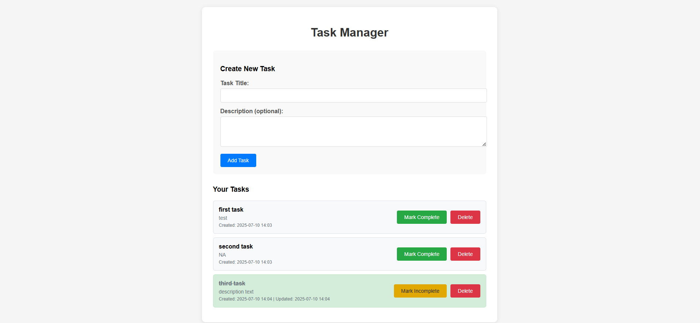

# FastAPI Task Management System



A full-featured task management application built with FastAPI, SQLAlchemy, and Jinja2 templates. This application provides both REST API endpoints and a beautiful web interface for managing your tasks.

## Features

- ✅ **Complete CRUD Operations** - Create, Read, Update, Delete tasks
- 🌐 **Web Interface** - Beautiful, responsive UI built with Jinja2 templates
- 🔌 **REST API** - Full RESTful API with proper HTTP status codes
- 💾 **Database Storage** - SQLite database with SQLAlchemy ORM
- 📝 **Task Management** - Add descriptions, mark complete/incomplete
- 🎨 **UI** - Clean, responsive design with CSS styling
- 📚 **API Documentation** - Auto-generated OpenAPI docs
- ⚡ **Fast Performance** - Built on FastAPI for high performance

## Screenshots

### Web Interface
The main web interface provides an intuitive way to manage your tasks:
- Clean task creation form
- Visual task list with completion status
- One-click toggle for task completion
- Delete confirmation for safety

### API Documentation
Access interactive API documentation at `/docs` endpoint with:
- Try-it-out functionality
- Request/response examples
- Schema definitions

## Installation

### Prerequisites
- Python 3.7+
- pip package manager

### 1. Clone or Download
Save the `app.py` file to your project directory.

### 2. Install Dependencies
```bash
pip install fastapi uvicorn sqlalchemy jinja2 python-multipart
```

### 3. Run the Application
```bash
python app.py
```

### 4. Access the Application
- **Web Interface**: http://localhost:8000/
- **API Documentation**: http://localhost:8000/docs
- **Alternative API Docs**: http://localhost:8000/redoc

## Usage

### Web Interface

1. **Create Tasks**
   - Fill in the task title (required)
   - Add description (optional)
   - Click "Add Task"

2. **Manage Tasks**
   - Click "Mark Complete" to finish a task
   - Click "Mark Incomplete" to reopen a task
   - Click "Delete" to remove a task (with confirmation)

3. **View Tasks**
   - All tasks are displayed in a clean list
   - Completed tasks are visually distinguished
   - Timestamps show when tasks were created/updated

### API Endpoints

#### Get All Tasks
```bash
GET /tasks
```
```bash
curl http://localhost:8000/tasks
```

#### Create a New Task
```bash
POST /tasks
```
```bash
curl -X POST "http://localhost:8000/tasks" \
  -H "Content-Type: application/json" \
  -d '{
    "title": "Learn FastAPI",
    "description": "Complete the FastAPI tutorial",
    "completed": false
  }'
```

#### Update a Task
```bash
PUT /tasks/{task_id}
```
```bash
curl -X PUT "http://localhost:8000/tasks/1" \
  -H "Content-Type: application/json" \
  -d '{
    "title": "Learn FastAPI - Updated",
    "completed": true
  }'
```

#### Delete a Task
```bash
DELETE /tasks/{task_id}
```
```bash
curl -X DELETE "http://localhost:8000/tasks/1"
```

## Project Structure

```
task-manager/
├── app.py              # Main application file
├── tasks.db            # SQLite database (auto-created)
├── templates/          # Jinja2 templates (auto-created)
│   ├── index.html      # Main web interface
│   └── 404.html        # Error page
├── banner.png          # Banner image for README
└── README.md           # This file
```

## Configuration

### Database Configuration
The application uses SQLite by default. You can modify the database URL in `app.py`:

```python
# File-based database (persistent)
SQLALCHEMY_DATABASE_URL = "sqlite:///./tasks.db"

# In-memory database (temporary)
SQLALCHEMY_DATABASE_URL = "sqlite:///:memory:"
```

### Server Configuration
Default server settings:
- **Host**: 0.0.0.0 (accessible from all network interfaces)
- **Port**: 8000
- **Reload**: Enabled for development

## API Response Examples

### Get Tasks Response
```json
[
  {
    "id": 1,
    "title": "Learn FastAPI",
    "description": "Complete the FastAPI tutorial",
    "completed": false,
    "created_at": "2025-07-10T10:30:00.000Z",
    "updated_at": "2025-07-10T10:30:00.000Z"
  }
]
```

### Create Task Response
```json
{
  "id": 1,
  "title": "Learn FastAPI",
  "description": "Complete the FastAPI tutorial",
  "completed": false,
  "created_at": "2025-07-10T10:30:00.000Z",
  "updated_at": "2025-07-10T10:30:00.000Z"
}
```

## HTTP Status Codes

- **200 OK** - Successful GET/PUT requests
- **201 Created** - Successful POST requests
- **204 No Content** - Successful DELETE requests
- **404 Not Found** - Task not found
- **422 Validation Error** - Invalid request data

## Database Schema

### Tasks Table
| Column | Type | Description |
|--------|------|-------------|
| id | Integer | Primary key (auto-increment) |
| title | String | Task title (required) |
| description | String | Task description (optional) |
| completed | Boolean | Completion status (default: false) |
| created_at | DateTime | Creation timestamp |
| updated_at | DateTime | Last update timestamp |

## Development

### Adding New Features
1. **Database Models**: Modify `TaskModel` class in `app.py`
2. **API Endpoints**: Add new endpoints following the existing pattern
3. **Web Interface**: Update templates in the `templates/` directory
4. **Validation**: Update Pydantic models for request/response validation

### Running in Development Mode
The application runs with auto-reload enabled by default:
```bash
python app.py
```

## Troubleshooting

### Common Issues

1. **"UnicodeEncodeError" on Windows**
   - Fixed in the current version with UTF-8 encoding

2. **"Port already in use"**
   ```bash
   # Kill process using port 8000
   lsof -ti:8000 | xargs kill -9  # macOS/Linux
   netstat -ano | findstr :8000   # Windows
   ```

3. **Templates not found**
   - Templates are auto-created when running the application
   - Check if `templates/` directory exists in your project folder

4. **Database connection issues**
   - Ensure SQLite is available (included with Python)
   - Check file permissions in the project directory

## Tech Stack

- **FastAPI** - Modern, fast web framework for Python
- **SQLAlchemy** - SQL toolkit and Object-Relational Mapping
- **SQLite** - Lightweight database engine
- **Jinja2** - Modern templating engine
- **Pydantic** - Data validation using Python type hints
- **Uvicorn** - ASGI server implementation

---
