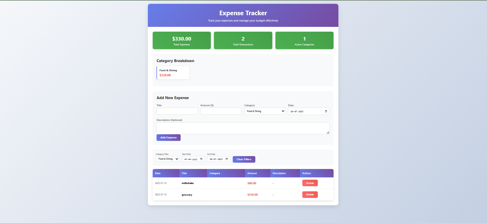

# 💰 Expense Tracker - FastAPI Application



A modern, full-featured expense tracking application built with FastAPI, featuring a beautiful web interface and comprehensive REST API for managing personal expenses.

## 🌟 Features

### 📊 **Web Interface**
- Beautiful, responsive design that works on all devices
- Real-time form validation with visual feedback
- Interactive expense table with sorting and filtering
- Category-based expense breakdown charts
- Date range filtering capabilities
- Keyboard shortcuts for power users (Alt+N, Alt+F)

### 🚀 **REST API**
- Complete CRUD operations for expenses
- Category-based filtering
- Date range queries
- Expense summaries and analytics
- Interactive API documentation with Swagger UI
- Proper error handling and validation

### 🗄️ **Database**
- SQLite database with SQLAlchemy ORM
- Automatic table creation and migration
- Sample data for testing
- Proper session management

## 🛠️ Technologies Used

- **Backend**: FastAPI, SQLAlchemy, Pydantic
- **Database**: SQLite
- **Frontend**: HTML5, CSS3, JavaScript, Jinja2 Templates
- **Package Manager**: UV (modern Python package manager)
- **Server**: Uvicorn ASGI server

## 📋 Prerequisites

- Python 3.12 or higher
- UV package manager (recommended) or pip

## 🚀 Quick Start

### 1. Clone the Repository
```bash
git clone <your-repo-url>
cd ticket_booking_system
```

### 2. Install Dependencies
Using UV (recommended):
```bash
uv sync
```

Or using pip:
```bash
pip install -r requirements.txt
```

### 3. Run the Application
```bash
uv run main.py
```

The application will start on `http://localhost:8000`

## 🎯 Usage

### Web Interface
1. Open your browser and navigate to `http://localhost:8000`
2. Use the form to add new expenses
3. Filter expenses by category or date range
4. View expense summaries and breakdowns
5. Delete expenses with confirmation

### API Documentation
- **Swagger UI**: `http://localhost:8000/docs`
- **ReDoc**: `http://localhost:8000/redoc`

## 📡 API Endpoints

### Expenses Management
```
GET    /expenses                    # Get all expenses (with optional filters)
POST   /expenses                    # Create new expense
PUT    /expenses/{expense_id}       # Update existing expense
DELETE /expenses/{expense_id}       # Delete expense
```

### Filtering & Analytics
```
GET    /expenses/category/{category}  # Get expenses by category
GET    /expenses/total               # Get expense summaries and breakdowns
```

### Query Parameters
- `start_date` - Filter from date (YYYY-MM-DD)
- `end_date` - Filter to date (YYYY-MM-DD)
- `category` - Filter by expense category

### Example API Calls

**Get all expenses:**
```bash
curl http://localhost:8000/expenses
```

**Create new expense:**
```bash
curl -X POST http://localhost:8000/expenses \
  -H "Content-Type: application/json" \
  -d '{
    "title": "Lunch",
    "amount": 15.50,
    "category": "Food & Dining",
    "description": "Business lunch"
  }'
```

**Get expenses by date range:**
```bash
curl "http://localhost:8000/expenses?start_date=2024-01-01&end_date=2024-12-31"
```

## 🏗️ Project Structure

```
ticket_booking_system/
├── main.py                 # Main FastAPI application
├── templates/
│   ├── index.html         # Main web interface
│   └── 404.html           # Custom error page
├── pyproject.toml         # Project dependencies
├── uv.lock               # Lock file for dependencies
├── expenses.db           # SQLite database (auto-created)
└── README.md             # This file
```

## 🎨 Categories

The application supports 9 predefined expense categories:
- 🍽️ Food & Dining
- 🚗 Transportation
- 🎬 Entertainment
- 💡 Utilities
- 🏥 Healthcare
- 🛒 Shopping
- 📚 Education
- ✈️ Travel
- 📋 Other

## 🔧 Configuration

### Environment Variables
You can customize the application by setting these environment variables:

```bash
# Database URL (default: sqlite:///./expenses.db)
DATABASE_URL=sqlite:///./expenses.db

# Server host (default: 0.0.0.0)
HOST=0.0.0.0

# Server port (default: 8000)
PORT=8000
```

### Database Schema
The application uses a simple schema with the following fields:
- `id` - Primary key
- `title` - Expense title
- `amount` - Expense amount (must be positive)
- `category` - Expense category
- `description` - Optional description
- `date` - Expense date
- `created_at` - Record creation timestamp
- `updated_at` - Record update timestamp

## 🎹 Keyboard Shortcuts

- `Alt + N` - Focus on new expense form
- `Alt + F` - Focus on category filter

## 🐛 Troubleshooting

### Common Issues

**Port already in use:**
```bash
# Kill process using port 8000
lsof -ti:8000 | xargs kill -9
```

**Database issues:**
```bash
# Delete database file to reset
rm expenses.db
```

**Template not found:**
```bash
# Ensure templates directory exists
mkdir -p templates
```

## 📈 Future Enhancements

- [ ] User authentication and multi-user support
- [ ] Export data to CSV/Excel
- [ ] Expense budgeting and alerts
- [ ] Receipt image uploads
- [ ] Mobile app with React Native
- [ ] Advanced analytics and reporting
- [ ] Integration with bank APIs
- [ ] Multi-currency support

## 🤝 Contributing

1. Fork the repository
2. Create your feature branch (`git checkout -b feature/amazing-feature`)
3. Commit your changes (`git commit -m 'Add some amazing feature'`)
4. Push to the branch (`git push origin feature/amazing-feature`)
5. Open a Pull Request

## 📝 License

This project is licensed under the MIT License - see the LICENSE file for details.

## 👨‍💻 Author

Created with ❤️ by [Your Name]

## 🆘 Support

If you encounter any issues or have questions:

1. Check the [troubleshooting section](#-troubleshooting)
2. Look at the [API documentation](http://localhost:8000/docs)
3. Create an issue in the repository

---

## 🎉 Enjoy tracking your expenses!

The application is designed to be simple, beautiful, and functional. Start by adding your first expense and explore all the features available through both the web interface and REST API.

**Happy expense tracking! 💰✨**
